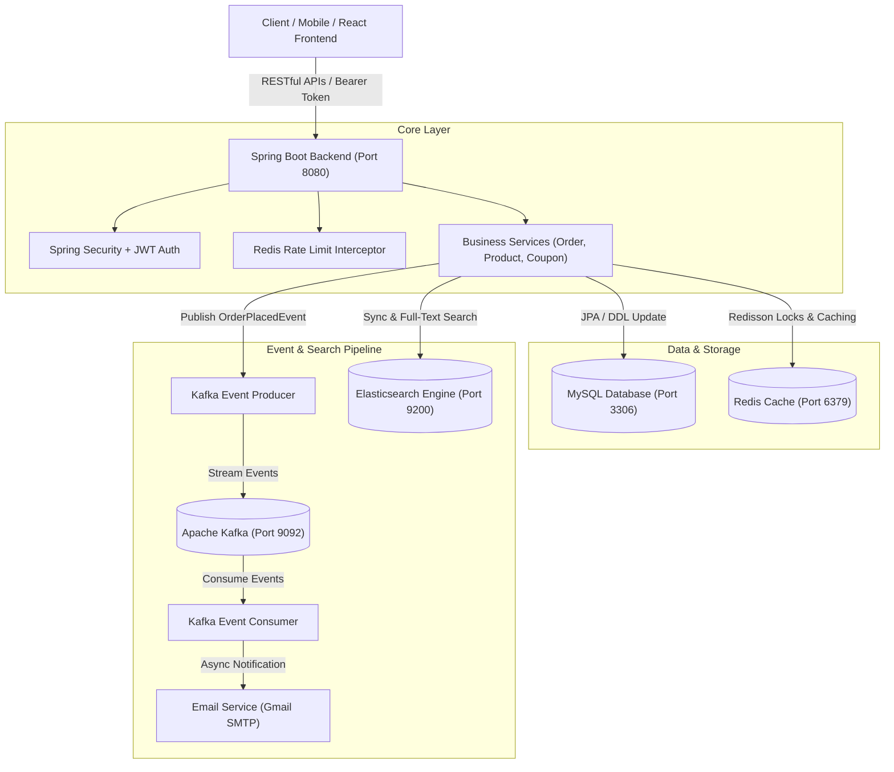

# 🛒 Enterprise Distributed E-Commerce System


Hệ thống Backend Thương mại Điện tử Kiến trúc Phân tán (Distributed System) chuẩn Enterprise, được thiết kế theo mô hình **Event-Driven Architecture**, tối ưu hóa cho hệ thống chịu tải cao (High Concurrency) và đáp ứng đầy đủ tiêu chuẩn xin việc **Junior Java Backend Developer**.

---

## 🎯 Công nghệ

- 🚀 **Event-Driven Architecture với Apache Kafka**:
  - Đóng gói các sự kiện `OrderPlacedEvent` & `ProductSyncEvent` đẩy lên Kafka Event Streams.
  - Tách biệt (Decoupling) tác vụ gửi Mail xác nhận đơn hàng và đồng bộ dữ liệu ngầm bằng `OrderKafkaConsumer`, giúp thời gian phản hồi HTTP Response chỉ **<20ms**.
- 🔍 **High-Performance Search Engine với Elasticsearch**:
  - Triển khai Full-Text Search sản phẩm với thuật toán **Fuzzy Matching** & **BM25 Relevance Scoring**.
  - Xây dựng cơ chế **Smart Fallback**: Tự động chuyển hướng truy vấn mượt mờ sang MySQL JPA Search nếu Elasticsearch Cluster tạm thời ngắt kết nối.
- 🔒 **Distributed Locking với Redisson**:
  - Sử dụng Redisson Distributed Lock (`lock:product:<id>`, `lock:coupon:<code>`) xử lý triệt để bài toán **Overselling (Bán quá kho)** và **Race Condition** khi nhiều người dùng cùng tranh mua hàng và đổi voucher đồng thời.
- 🛡️ **Redis Rate Limiting & Gateway Protection**:
  - Tích hợp `RateLimitInterceptor` dựa trên Redis Token Bucket, giới hạn 10 requests/phút/IP đối với các endpoint nhạy cảm (Register, Forgot Password, Coupon Validate), ngăn chặn hiệu quả tấn công Brute-force & DDOS.
- ⚡ **Asynchronous Thread Pool Processing**:
  - Cấu hình `ThreadPoolTaskExecutor` chuyên biệt với Spring `@Async` xử lý gửi mail mã OTP xác thực và thông báo đơn hàng ngầm không làm nghẽn Main Thread.
- 🐳 **Full Containerization với Docker & Docker Compose**:
  - Đóng gói toàn bộ hệ thống gồm 6 containers: **Spring Boot Backend (Multi-stage build ~200MB)**, **MySQL 8.0**, **Redis 7**, **Zookeeper**, **Apache Kafka**, **Elasticsearch 8** trong 1 câu lệnh `docker compose up -d`.

---

## 🏛️ Kiến Trúc Hệ Thống (Architecture Diagram)



---

## 🛠️ Công Nghệ Sử Dụng (Tech Stack)

| Hạng mục | Công nghệ sử dụng |
| :--- | :--- |
| **Core Framework** | Java 17, Spring Boot 3.4.3 |
| **Security & Auth** | Spring Security, JWT (JSON Web Token), OAuth2 Resource Server |
| **Database & ORM** | MySQL 8.0, Spring Data JPA, Hibernate ORM 6 |
| **Caching & Locking** | Redis, Redisson 3.36, Spring Cache Abstraction |
| **Message Broker** | Apache Kafka (Spring Kafka), Zookeeper |
| **Search Engine** | Elasticsearch 8.12, Spring Data Elasticsearch |
| **API Documentation** | OpenAPI 3.0, Springdoc Swagger UI 2.8 |
| **Mail & Async** | Spring Mail, JavaMailSender, `@Async` TaskExecutor |
| **Containerization** | Docker, Docker Compose (Multi-stage Build) |
| **Build Tool** | Gradle 8.13 |

---

## 🔌 Danh Sách RESTful APIs

Giao diện trực quan OpenAPI xem tại: **`http://localhost:8080/swagger-ui/index.html`**

### 🔐 Auth & Profile (`/api/auth`)
- `POST /api/auth/login`: Đăng nhập lấy Bearer Access Token.
- `POST /api/auth/register`: Đăng ký tài khoản khách hàng mới.
- `GET /api/auth/profile`: Lấy thông tin cá nhân người dùng hiện tại.
- `POST /api/auth/forgot-password`: Gửi mã xác nhận OTP quên mật khẩu qua Email.
- `PATCH /api/auth/change-password`: Đổi mật khẩu.

### 📱 Product & Search (`/api/product`)
- `GET /api/product/search/es?keyword=...`: **Tìm kiếm sản phẩm tốc độ cao bằng Elasticsearch**.
- `GET /api/product/getAllProduct`: Lấy danh sách sản phẩm (Hỗ trợ phân trang).
- `POST /api/product/createProduct`: Tạo sản phẩm mới (Chỉ dành cho ADMIN).
- `PUT /api/product/updateProduct/{id}`: Cập nhật thông tin sản phẩm (ADMIN).
- `DELETE /api/product/deleteProduct/{id}`: Xóa sản phẩm (ADMIN).

### 📂 Category (`/api/category`)
- `GET /api/category/getAllCat`: Lấy tất cả danh mục sản phẩm.
- `GET /api/category/getAllClient`: Lấy danh mục phổ biến hiển thị trang chủ.
- `POST /api/category/createCat`: Tạo danh mục mới (ADMIN).

### 🎟️ Coupon System (`/api/coupons`)
- `GET /api/coupons/all`: Lấy danh sách mã giảm giá.
- `POST /api/coupons/create`: Tạo mã giảm giá mới (Phần trăm / Tiền cố định).
- `POST /api/coupons/validate`: Kiểm tra tính hợp lệ & tính tiền giảm giá.

### 🛒 Cart & Order (`/api/cart`, `/api/order`, `/api/payment`)
- `POST /api/cart/addCart`: Thêm sản phẩm vào giỏ hàng.
- `GET /api/cart/getCart`: Xem thông tin giỏ hàng người dùng.
- `POST /api/order/cod`: Đặt hàng thanh toán COD (**Kích hoạt Kafka Order Event**).
- `POST /api/payment/vnpay`: Tạo URL thanh toán VNPay Sandbox.

---

## 🚀 Hướng Dẫn Chạy Dự Án (Quick Start)

### CÁCH 1: Chạy Bằng Docker Compose (Khuyên dùng - 1 Câu lệnh)

Yêu cầu: Đã cài đặt **Docker Desktop** trên máy.

```bash
# 1. Clone repository
git clone https://github.com/huuhoang150424/web-b-n-h-ng-java.git
cd web-b-n-h-ng-java

# 2. Khởi chạy toàn bộ cụm 6 Containers (App, MySQL, Redis, Kafka, Zookeeper, ES)
docker compose up -d --build

# 3. Kiểm tra trạng thái các container
docker compose ps
```

📌 Sau khi khởi chạy thành công:
- **Swagger UI**: Truy cập ngay tại **[http://localhost:8080/swagger-ui/index.html](http://localhost:8080/swagger-ui/index.html)**
- **Elasticsearch API**: `http://localhost:8080/api/product/search/es?keyword=iphone`

---

### CÁCH 2: Chạy Thủ Công Trên Máy Local

Yêu cầu: **Java 17**, **MySQL 8**, **Redis** cài đặt sẵn trên máy.

```bash
# 1. Mở MySQL và tạo Database
CREATE DATABASE webbanhang;

# 2. Thiết lập đường dẫn Java 17 và biên dịch
export JAVA_HOME=/path/to/java-17
./gradlew compileJava

# 3. Khởi chạy ứng dụng Spring Boot
./gradlew bootRun
```

---

## 📊 Dữ Liệu Test Mẫu Sẵn Có (Seeded Data)

Hệ thống tự động khởi tạo dữ liệu mẫu khi bạn chạy lần đầu tiên:

- **🔑 Tài khoản Test**:
  - **Tài khoản Admin**: `admin@gmail.com` | Password: `12345678`
  - **Tài khoản Customer**: `user@gmail.com` | Password: `12345678`
- **📱 Sản phẩm mẫu**: iPhone 15 Pro Max 256GB, MacBook Air M3, AirPods Pro 2.
- **🎟️ Mã giảm giá mẫu**: `WELCOME100` (Giảm 100k), `SUMMER20` (Giảm 20%), `VIPFLASH` (Giảm 500k).
